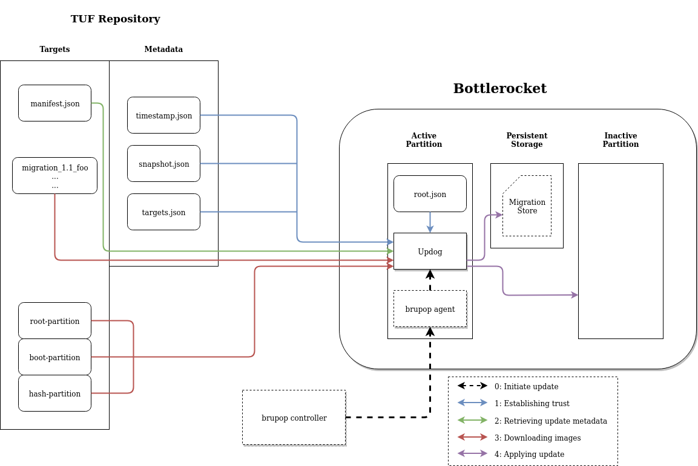

# Bottlerocket update infrastructure
This document describes the Bottlerocket update system and its components, namely;

- tough: implementation of "The Update Framework" (TUF)
- updog: update client that interfaces with a TUF repository to find and apply updates
- signpost: helper tool to update partition priority flags
- dogswatch: an optional component that coordinates node updates with the rest of the cluster

## TUF and tough
A TUF repository is a collection of metadata files and 'target' files that clients can download.
In Bottlerocket there are four metadata files used to establish trusted updates: root, timestamp, snapshot, and targets.
Each metadata file is individually signed and serves a distinct purpose.

The root.json file begins the chain of trust for working with a TUF repository.
It lists the keys that a Bottlerocket instance trusts in order to verify the rest of the metadata.
The root.json file is part of the Bottlerocket image, but can be updated from the TUF repo assuming the new root.json is signed by a certain number of keys from the old.
In the Bottlerocket model multiple keys are used to sign root.json, and the loss of some amount of keys under the threshold does not prevent updating to a new root.json that contains new trusted keys.

The timestamp.json file contains the hash of the current snapshot.json file and is frequently re-signed to prevent the use of out-of-date metadata.

The snapshot.json file lists the current versions of all other metadata files in the TUF repository, aside from timestamp.json.
Once verified by timestamp.json the snapshot file ensures the client only sees the most up-to-date versions of root.json and targets.json.

The targets.json file lists all the available 'target' files in the TUF repository and their hashes.
For Bottlerocket this includes a 'manifest.json' file and any update images or migration files that have been made available.
(For more information on migrations see [migration](../api/migration))

Update metadata and files can be found by requesting and verifying these metadata files in order, and then requesting the manifest.json target which describes all available updates.
Any file listed in the manifest is also a TUF 'target' listed in targets.json and can only be downloaded via the TUF repository, preventing the client from downloading untrusted data.

## Updog
Updog is the client tool that interacts with a 'The Update Framework' (TUF) repository to download and write updates to a Bottlerocket partition.
Updog will parse the manifest.json file from the TUF repository and will update to a new image if the following criteria are satisfied:
### Version & Variant
By default Updog only considers updates resulting in a version increase; downgrades are possible by using the `--image` option to force a specific version.
Updog will respect the `max_version` field in the update manifest and refuse to update beyond it.
Updog also considers the Bottlerocket "variant" of its current image and will not download updates for a different variant.

Updog will ensure that appropriate migration files are available to safely transition to the new version and back.

### Update wave
Updates may include "wave" information which provides a way for updates to be scheduled over time for groups of Bottlerocket hosts.
Updog will find the update wave the host belongs to and jitter its update time within that range.
If the calculated time has not passed yet, Updog returns the update timestamp to the caller so it can be called again at the correct time.

Assuming all the requirements are met, Updog requests the update images from the TUF repository and writes them to the "inactive" partition.

For more information on what's Updog see [Updog](updog/).
For more information about update waves see [Waves](waves/).

## Signpost
Once an update has been successfully written to the inactive partition, Updog calls the Signpost utility.
This updates the priority bits in the GUID partition table of each partition and swaps the "active" and "inactive" partitions.
For more information see [Signpost](signpost/)
